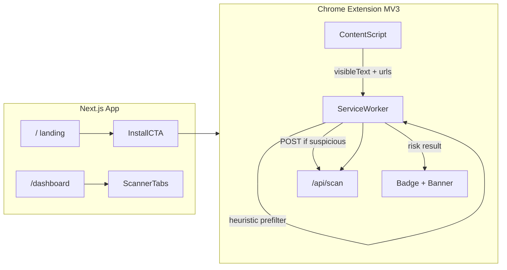

# MakGuard Passive Browser Extension + Landing Page

## Assessment of the idea

Your mentor's direction is the right product move. The current app at [`app/page.tsx`](app/page.tsx) is **reactive** — the user must notice something suspicious, copy it, and paste it. A passive extension closes the gap the PRD describes: intercepting scams **before** the user acts, without requiring them to think "I should scan this."

**What works well:**
- Reuses your existing Gemini pipeline in [`app/api/scan/route.ts`](app/api/scan/route.ts) and validation in [`lib/scan.ts`](lib/scan.ts) — no need to rebuild AI logic
- Non-blocking alerts (badge color + small slide-in banner) let users keep reading email or filling forms while being warned
- One-time enable via extension toggle matches the "set and forget" UX your mentor described
- Landing page separates **marketing/install** from **tools**, which is cleaner as the product grows

**Important constraints to design around:**

| Constraint | Implication |
|---|---|
| Browser extension only runs in the browser | Passive scan works on Gmail/Outlook **web**, WhatsApp Web, scam sites — not native desktop email apps |
| Gemini free-tier quota | Cannot call AI on every page load; use local heuristics first + debounce + cache |
| Privacy | Never send full page HTML; extract visible text + URLs only, truncate before API call |
| Hackathon demo | Ship as "Load unpacked" extension; Chrome Web Store is out of scope for v1 |



---

## Architecture

### 1. Route restructure (web app)

| Route | Purpose |
|---|---|
| `/` | New landing page — short intro, how it works, install-time install CTA, link to dashboard |
| `/dashboard` | Move current [`app/page.tsx`](app/page.tsx) here unchanged in behavior |
| `/shield`, `/report` | Keep as-is (optional: add nav links from landing later) |

**Implementation:** Create [`app/(marketing)/page.tsx`](app/(marketing)/page.tsx) for landing; move dashboard to [`app/dashboard/page.tsx`](app/dashboard/page.tsx). Use a route group so landing and dashboard can share [`app/layout.tsx`](app/layout.tsx).

Landing page content (minimal, on-brand with existing dark terminal aesthetic from [`docs/STYLE_GUIDE.md`](docs/STYLE_GUIDE.md)):
- Hero: "MakGuard — Malaysia's passive scam shield"
- 3-step flow: Install extension → Enable once → Browse safely
- Primary CTA: "Install Extension" (links to install instructions section with unpacked-load steps for demo)
- Secondary CTA: "Open Dashboard" → `/dashboard`

### 2. Chrome extension (`extension/` folder at repo root)

New top-level directory, separate from Next.js build:

```
extension/
├── manifest.json          # MV3
├── background.js          # Service worker: orchestration, API calls, caching
├── content.js             # DOM text/URL extraction
├── alert.js + alert.css   # Non-blocking banner injected into page
├── popup.html/js          # Enable/disable toggle + status
└── icons/                 # 16/48/128px MakGuard icons
```

**manifest.json key permissions:**
- `storage` — persist enabled/disabled state
- `activeTab` or `<all_urls>` host permission — read page content (use `<all_urls>` for passive email/web scanning)
- `host_permissions`: your deployed API origin (e.g. `https://makguard.vercel.app/*`) + `http://localhost:3000/*` for dev

**Passive scan flow:**

1. **Content script** fires on `document_idle`, extracts:
   - `document.body.innerText` (visible text only, not HTML source)
   - All `href` values from `<a>` tags
   - Current page URL
2. Sends payload to **service worker** via `chrome.runtime.sendMessage`
3. **Service worker** applies guards before calling API:
   - Extension disabled? → skip
   - Same URL scanned in last 5 min? → skip (in-memory cache)
   - Text shorter than 50 chars? → skip
   - **Local heuristic prefilter** — only proceed if text/URLs match suspicious patterns (bank names, "OTP", "TAC", "account suspended", `.xyz`/`.top` TLDs, etc.)
4. If prefilter passes → `POST /api/scan` with `{ message: truncatedText, source: "extension", page_url: url }`
5. On result:
   - `risk_score <= 30` → green badge or no alert (silent)
   - `31–60` → amber badge only (no banner — suspicious but not confirmed)
   - `61+` → red badge + **non-blocking banner** (fixed top-right, dismissible, does not block clicks on page underneath)

**Enable/disable UX:**
- Popup toggle: "Protection ON / OFF" stored in `chrome.storage.local`
- Default ON after install
- Badge shows shield icon color reflecting last scan result on current tab

### 3. API adjustments

Minimal changes to [`app/api/scan/route.ts`](app/api/scan/route.ts):

- Accept optional `page_url` field for logging/context (append to prompt: "This text was extracted from a web page at {url}")
- Add optional `source: "extension"` for future analytics
- Truncate incoming `message` server-side to ~3000 chars max (defense in depth)
- Add CORS headers **or** rely on extension `host_permissions` (extensions bypass CORS when origin is permitted — no CORS change needed if using host_permissions correctly)

Optional lightweight endpoint [`app/api/scan/prefilter/route.ts`](app/api/scan/prefilter/route.ts) is **not recommended for hackathon** — keep heuristics client-side to avoid extra latency.

**Rate-limit safety (hackathon):** Client-side debounce (5 min per URL) + heuristic gate should keep Gemini calls under ~20–50/day per user during demo. Document this in README.

### 4. Notification design (non-obstructive)

When `risk_score >= 61`:

```
┌─────────────────────────────────────┐
│ ⚠ MakGuard detected a likely scam   │
│ Bank impersonation · Score 78/100   │
│ [View details]  [Dismiss]           │
└─────────────────────────────────────┘
```

- Position: `position: fixed; top: 16px; right: 16px; z-index: 2147483647`
- "View details" opens popup or new tab to `/dashboard?scan=...` (stretch goal) or expands inline
- Auto-dismiss after 30s if user ignores
- Never use `window.alert()` or full-screen modals

---

## Execution phases

### Phase A — Landing page (web, ~2–3 hrs)
- Create route group and landing page at `/`
- Move dashboard to `/dashboard`
- Add nav link from landing → dashboard
- Add "Install Extension" section with developer install steps

### Phase B — Extension skeleton (~2 hrs)
- `manifest.json` + icons + popup toggle
- Verify enable/disable persists across browser restart
- Test message passing content → background

### Phase C — Passive scan pipeline (~3–4 hrs)
- Content script extraction + heuristic prefilter in app/api/scan/route.ts` — add `page_url`, truncation
- Service worker: debounce, cache, API call, badge update

### Phase D — Alert UI (~2 hrs)
- Inject dismissible banner on high-risk results
- Badge colors: green / amber / red / gray (disabled)

### Phase E — Demo polish (~1–2 hrs)
- Seed 2–3 demo URLs (fake bank SMS page, safe news page) for pitch
- Update [`README.project.md`](README.project.md) with extension install + demo script
- Deploy to Vercel; point extension `host_permissions` at production URL

---

## What to defer (post-hackathon)

- Chrome Web Store publishing and review
- Firefox / Safari extensions
- Scanning native desktop email clients
- Screenshot capture of visible tab (expensive; text-first is enough for MVP)
- User accounts / API auth for extension
- VirusTotal URL pre-check mentioned in [`docs/TECH_SPECS.md`](docs/TECH_SPECS.md)

---

## Demo script for judges

1. Open landing page → show install CTA
2. Load unpacked extension → toggle ON
3. Navigate to a pre-built fake "Maybank account suspended" HTML page → banner appears within ~3s
4. Navigate to a normal site → no banner, green/silent badge
5. Show `/dashboard` manual scanner still works for screenshots the extension cannot auto-capture
