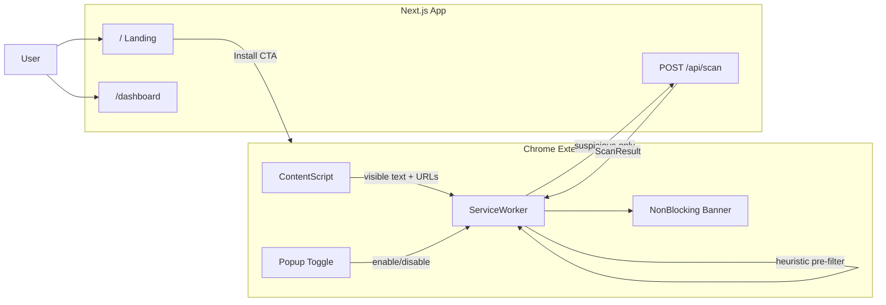

# MakGuard Passive Browser Extension + Landing Page

## Thoughts on the idea

Your mentor's direction is the right one for MakGuard's mission. The current web app is **reactive** (user must paste/upload). A passive extension is **proactive** — it intercepts threats at the moment they appear, which aligns with the PRD goal of stopping scams *before* money moves.

**What works well:**
- Reuses your existing [`POST /api/scan`](app/api/scan/route.ts) pipeline (Gemini + `parseScanResult`) — no need to rebuild AI logic
- Complements the manual scanner: extension for everyday browsing, dashboard for deep analysis and community reporting
- Non-blocking alerts (badge + slide-in banner) let users keep reading/acting while staying informed
- One-time enable via extension toggle matches the "set and forget" UX your mentor described

**Important constraints to design around:**

| Constraint | Implication |
|---|---|
| Browser-only | Extension scans **web pages** (Gmail web, Outlook web, scam sites). It cannot read native desktop email apps (Outlook desktop, Apple Mail). |
| Gemini cost/quota | Scanning every page load will burn free-tier quota fast. Must use **local heuristics first**, then AI only when suspicious. |
| Privacy | Never send full page HTML. Extract visible text + URLs only, truncate to ~2–3 KB, skip sensitive domains (banking login pages) optionally. |
| Hackathon demo | Ship as **"Load unpacked"** extension — Chrome Web Store review takes weeks. |



---

## Architecture

### 1. Route restructure (landing page)

| Route | Purpose |
|---|---|
| [`/`](app/page.tsx) | **New landing page** — short intro, how it works, install extension CTA, link to dashboard |
| [`/dashboard`](app/dashboard/page.tsx) | **Move current dashboard** — rename/refactor existing 1200-line [`app/page.tsx`](app/page.tsx) here unchanged in behavior |
| `/shield`, `/report` | Keep as-is (legacy standalone pages) |

Landing page content (minimal, hackathon-appropriate):
- Hero: "MakGuard — Malaysia's AI scam shield"
- 3-step flow: Install extension → Turn on once → Browse safely
- CTA: "Install Extension" (links to install instructions section) + "Open Dashboard"
- Install section: step-by-step for Chrome "Load unpacked" pointing to `extension/` folder

Match existing dark terminal aesthetic from [`docs/STYLE_GUIDE.md`](docs/STYLE_GUIDE.md).

### 2. Extension package (`extension/` at repo root)

New directory, separate from Next.js build:

```
extension/
├── manifest.json          # MV3
├── background.js          # Service worker: orchestration, API calls, caching
├── content.js             # DOM text/URL extraction
├── alert.css + alert.js   # Non-blocking slide-in banner
├── popup.html + popup.js  # Enable/disable toggle, last scan status
└── icons/                 # 16/48/128px MakGuard icons
```

**`manifest.json` essentials:**
- `permissions`: `storage`, `activeTab`, `scripting`
- `host_permissions`: `<all_urls>` (needed for passive scan on any site)
- `background.service_worker`: `background.js`
- `content_scripts`: inject `content.js` on `document_idle`
- `action.default_popup`: toggle UI

**Passive scan flow:**

1. **Content script** (`content.js`) on page load / SPA navigation:
   - Extract `document.body.innerText` (visible text only)
   - Collect `<a href>` URLs
   - Send `{ url, text, links }` to background via `chrome.runtime.sendMessage`

2. **Background worker** (`background.js`):
   - Check `chrome.storage.local.enabled` (default: `true` after first install)
   - **Debounce/dedupe**: skip if same URL scanned in last 5 min (cache in `chrome.storage.session`)
   - **Local heuristic pre-filter** (no API call unless triggered):
     - Malaysian scam keywords: `maybank`, `cimb`, `lhdn`, `pdrm`, `otp`, `tac`, `account suspended`, `verify now`, `won prize`, etc.
     - Suspicious URL patterns: non-official domains mimicking banks
   - If heuristics pass → POST to `{MAKGUARD_API_URL}/api/scan` with truncated message
   - On result: update badge color, store last result, notify content script if `risk_score >= 61`

3. **Non-blocking alert** (`alert.js` injected only on high risk):
   - Fixed bottom-right slide-in card (not modal, not full-screen)
   - Shows: risk score, 1-line explanation, "Dismiss" + "View details" (opens `/dashboard?scan=...` or popup)
   - Auto-dismiss after 15s; user can dismiss immediately
   - Never block clicks on the underlying page

4. **Popup toggle** (`popup.html`):
   - Master on/off switch (persisted in `chrome.storage.local`)
   - Status: "Protection active" / "Paused"
   - Last scan summary for current tab

**Environment config:** Extension reads API base URL from `chrome.storage.local.apiBaseUrl`, defaulting to production Vercel URL. Set during dev via popup or hardcoded in `background.js` for demo.

### 3. Backend changes (minimal)

**A. CORS for extension** — add to [`next.config.ts`](next.config.ts):

```ts
headers: [{ source: '/api/scan', headers: [
  { key: 'Access-Control-Allow-Origin', value: '*' },
  { key: 'Access-Control-Allow-Methods', value: 'POST, OPTIONS' },
] }]
```

Also add `OPTIONS` handler in [`app/api/scan/route.ts`](app/api/scan/route.ts) for preflight.

**B. Optional: page-context prompt tweak** — extend scan route to accept optional `source: 'extension (extension)` and prepend context like page URL + extracted links to the Gemini prompt. Reuses same `ScanResult` response — no new endpoint needed for MVP.

**C. Basic rate limiting** (recommended for demo stability):
- In-memory per-IP throttle in scan route: max ~10 requests/minute
- Extension-side: heuristic gate already limits volume

**D. Shared prompt extraction** — move `SYSTEM_PROMPT` from route into [`lib/scan.ts`](lib/scan.ts) so web app and extension use identical scoring rules.

### 4. What NOT to build in hackathon MVP

- Chrome Web Store publishing pipeline
- Firefox/Safari ports
- Screenshot capture of every page (expensive, privacy-heavy)
- Scanning inside iframes / shadow DOM edge cases
- User accounts / extension auth tokens
- Desktop email client integration

---

## Demo script (for judges)

1. Open landing page → show install flow
2. Enable extension → visit a pre-seeded scam page (local HTML fixture or known phishing demo text)
3. Extension badge turns red → non-blocking banner appears with explanation
4. User can still interact with page; dismiss banner
5. Open `/dashboard` → show manual scanner + community report still work

Include a `extension/fixtures/scam-demo.html` file with realistic Malaysian scam text for reliable demo.

---

## File change summary

| File / directory | Action |
|---|---|
| `app/page.tsx` | Replace with landing page |
| `app/dashboard/page.tsx` | Move current dashboard here |
| `extension/*` | New Chrome MV3 extension |
| `app/api/scan/route.ts` | CORS + optional page context + rate limit |
| `lib/scan.ts` | Extract shared `SYSTEM_PROMPT` |
| `next.config.ts` | CORS headers |
| `README.project.md` | Add extension install + dev instructions |

---

## Risk mitigations

- **Quota exhaustion**: Heuristic pre-filter + 5-min URL cache + truncate text to 2500 chars
- **False positives on banking sites**: Whitelist official domains (`maybank2u.com.my`, etc.) — skip scan or lower alert threshold
- **SPA navigation**: Use `MutationObserver` or listen for `history.pushState` in content script to re-scan on route changes (debounced)
- **Alert fatigue**: Only show banner at `risk_score >= 61`; badge-only for 31–60
