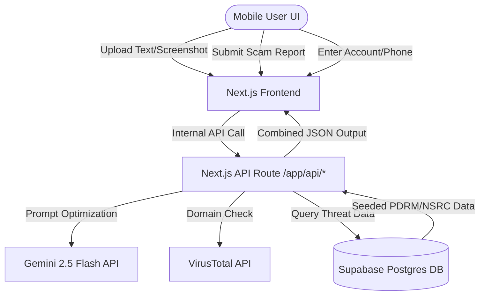

# Technical Specifications - MakGuard AI

## Tech Stack

- **Frontend & API Routes**: Next.js 14 (App Router), React 18, TypeScript, Tailwind CSS, shadcn/ui.
- **Database & Services**: Supabase (Postgres) via integrated REST client.
- **AI Core**: Gemini 2.5 Flash API (`gemini-2.5-flash`) for deep reasoning and structured text classification.
- **Security Check (Optional Depth)**: VirusTotal API for lightweight URL reputation checking.
- **Hosting Platform**: Vercel (Production deployment linked directly to GitHub).

## System Architecture

## Data Model / Schema (Supabase)

### `scam_reports`

- `id`: uuid (Primary Key, default: gen_random_uuid())
- `created_at`: timestamptz (default: now())
- `target_value`: text (The flagged account number, phone number, or URL)
- `value_type`: text (Enum: "phone", "account", "url")
- `threat_type`: text (e.g., "bank_impersonation", "investment_scam", "phishing")
- `report_count`: integer (Default: 1)
- `source`: text (Enum: "pdrm_seed", "nsrc_seed", "community_report")
- `reporter_notes`: text (nullable)
- `is_verified`: boolean (Default: false — true for seeded official data)

## Primary API Endpoints

- `POST /api/scan`: Accepts raw text payloads; forwards to Gemini 2.5 Flash; returns structured JSON with `risk_score`, `threat_tags`, and `explanation`.
- `POST /api/shield/verify`: Accepts an account or phone number; checks the `scam_reports` Supabase collection; returns a threat risk state.
- `POST /api/report`: Inserts or increments reported numbers inside the database registry.

## System Constraints

- **Zero Local Ops**: No Docker configurations, complex ORM setups, or custom database migrations. Use Supabase UI dashboards for seeding text.
- **Structured LLM Returns**: All AI calls must utilize structured system prompts to guarantee clean JSON parsing outputs.

